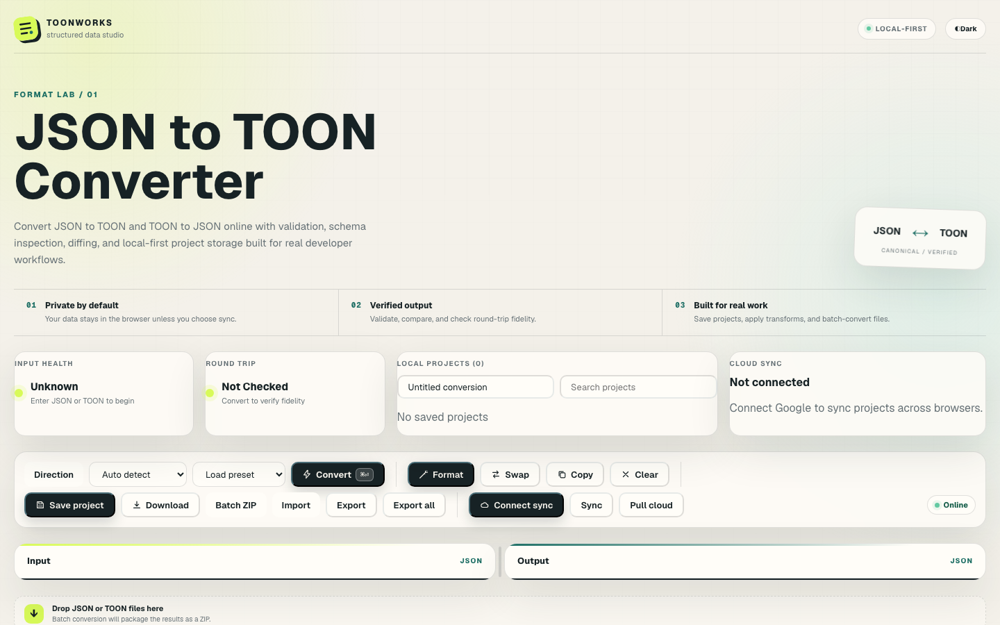
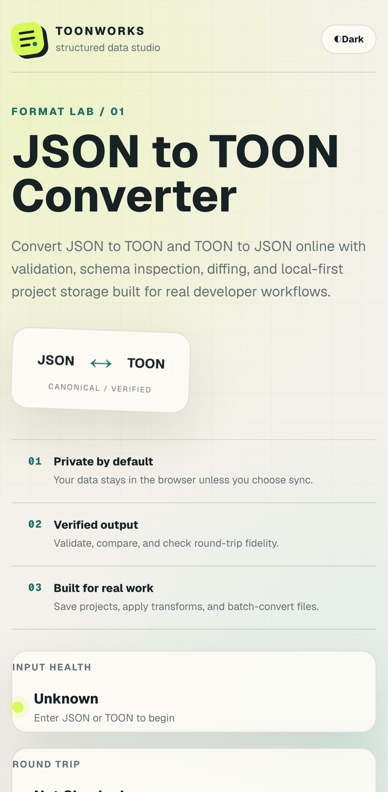

<p align="center">
  
</p>

<h1 align="center">JSON ↔ TOON Converter</h1>

<p align="center">
  Convert and inspect structured data in your browser. Validate inputs, compare formats, verify round trips, and keep project data local unless you opt into sync.
</p>

<p align="center">
  <a href="https://toon-json-converter.vercel.app/">Open the live converter</a>
  · <a href="https://toon-json-converter.vercel.app/examples/">Browse examples</a>
  · <a href="https://toon-json-converter.vercel.app/privacy/">Privacy</a>
</p>

<p align="center">
  <a href="https://github.com/TheOneWith-3j/toon-json-converter/actions/workflows/ci.yml"></a>
  <a href="https://toon-json-converter.vercel.app/"></a>
  <a href="https://github.com/toon-format/toon"></a>
</p>

<p align="center">
  
</p>

<details>
  <summary>View the mobile layout</summary>
  <p align="center">
    
  </p>
</details>

## What it does

TOONWORKS is a browser-based workspace for converting JSON and [TOON](https://github.com/toon-format/spec). It uses the official [`@toon-format/toon`](https://github.com/toon-format/toon) implementation.

- Convert in either direction with automatic format detection.
- Validate and format input, inspect inferred schemas, and compare line diffs.
- Check round-trip behavior and see exact character-size comparisons for your data.
- Apply rename, prefix, filter, and value-mapping rules before conversion.
- Batch-convert files to a ZIP archive.
- Save projects locally; optional Google/Firebase sync is available when configured.

Conversions run in the browser. Conversion contents are not sent to site analytics. See the [privacy policy](https://toon-json-converter.vercel.app/privacy/) for storage and optional-sync details.

## Try it

- [JSON to TOON converter](https://toon-json-converter.vercel.app/json-to-toon/)
- [TOON to JSON converter](https://toon-json-converter.vercel.app/toon-to-json/)
- [TOON vs JSON guide](https://toon-json-converter.vercel.app/toon-vs-json/)
- [Conversion examples](https://toon-json-converter.vercel.app/examples/)

The example gallery includes basic objects, uniform records, nested configuration, event data, primitive arrays, and keyed environment maps. Each TOON sample is generated by the same codec used in the converter.

## Local development

Requirements: Node.js 22 or newer and npm.

```sh
npm install
cp .env.example .env.local
npm run dev
```

Open `http://localhost:3000`. Firebase settings are optional; leave them unset to use local-only projects.

## Validate changes

```sh
npm run validate
```

This runs lint, TypeScript checks, unit tests, a production build, and Playwright browser tests. Install Chromium for the first local E2E run if needed:

```sh
npx playwright install chromium
```

## Deploy

The production site is hosted on Vercel. Import this repository and use the default Next.js build settings. Set `NEXT_PUBLIC_SITE_URL` to the deployed origin; set the `NEXT_PUBLIC_FIREBASE_*` web-app configuration only when enabling cloud sync. These Firebase web configuration values are public client settings, not service-account secrets.

GitHub Actions validates pushes and pull requests. Vercel creates preview and production deployments.

## Firebase project sync

Firebase is optional. To enable it, configure the public Firebase web app variables, enable Google sign-in, and publish the checked-in [`firestore.rules`](firestore.rules). See the [Firebase setup notes](docs/firebase-rules.md).

## Contributing

Bug reports, feature requests, and contributions are welcome. Use [GitHub Issues](https://github.com/TheOneWith-3j/toon-json-converter/issues) or the [contribution guide](CONTRIBUTING.md). The [contact page](https://toon-json-converter.vercel.app/contact/) prepares a public GitHub issue, so do not include private data or credentials.